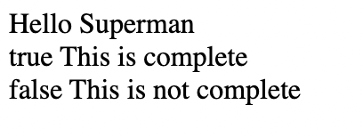
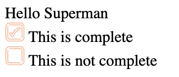
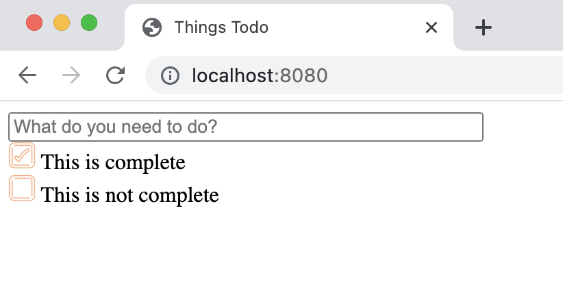

# Chapter 2: Components and the Virtual DOM

Modern front-end frameworks are powerful because they manage the rendering of the application in the browser based on user interaction.  All frameworks achieve this by adding a layer of abstraction between the application and the document object model (DOM).  This layer of abstraction is typically called the Virtual DOM.  

In this chapter we will build a very simple Virtual DOM, and use it to render components.  

To illustrate the Virtual DOM, this chapter will guide you through the creation of a to-do list application.  The application has the following user stories:

1. <a name="user-story-1"></a>As a user, I want to add an item to my todo list.
    * Type up to 50 characters in a single line text input.
    * Pressing the "Enter" key adds the item to the bottom of the list
    * After adding the item, the text input clears
2. <a name="user-story-2"></a>As a user, I want to indicate that an item in my list is complete.
    * Click on a check box adjacent to an incomplete item to mark it completed
    * font color for completed items turns light grey
    * checkbox toggles to checked
3. <a name="user-story-3"></a>As a user I want to incdicate that an item in my list is incomplete
    * Click on a check box adjacent to a completed item to mark it incomplete
    * font color for incomplete item turns black
    * check box toggles to unchecked

## Pre-reading

* [Using `fetch()`](https://developer.mozilla.org/en-US/docs/Web/API/Fetch_API/Using_Fetch)
* [`<input type="text">` Documentation](https://developer.mozilla.org/en-US/docs/Web/HTML/Element/input/text)
* [`keyup` events](https://developer.mozilla.org/en-US/docs/Web/API/Element/keyup_event)
* [Destructuring Assignment](https://developer.mozilla.org/en-US/docs/Web/JavaScript/Reference/Operators/Destructuring_assignment)

## Instructions

### Setup
Checkout the `chapter-2` branch of this repository. 
```bash
git checkout chapter-2
```

This command will replace the contents of `todo-list-project` with a completed and working `webpack.config.js` and `package.json` file.  

### Create a TodoListItem Component

Begin this chapter by creating a new file `src/TodoListItem.js`. This file will export a functional component that returns an HTMLElement representing a single item in our future todo list.  

```javascript
/**
 * Returns an HTMLElement representing a todo list item.
 * <code>item</code> must contain two properties:
 * @param item.complete A boolean representing if the item is completed or not
 * @param item.text A string for the todo item text to display
 */
export function TodoListItem(item) {
    const div = document.createElement('div');
    div.innerHTML = `
        ${item.complete} ${item.text}
    `;
    return div;
}
```

There is not much to this component right now. It just adds the completed
status and the text to a `<div>` element and returns that.  Notice that 
the completed status and the text are passed to the function as an object 
named `item`.  

Go ahead and add a few `TodoListItem` components to the page. 

```javascript
document.body.appendChild(TodoListItem({complete: true, text: "This is complete"}));
document.body.appendChild(TodoListItem({complete: false, text: "This is not complete"}));
```

Start the development server and view the page.  As you can see below, it is not very interesting.



In all likelihood you work with a *very demanding* graphic designer who has a very specific preference for what the checkmarks look like.  They have provided you with two `.png` files that you must use to represent the checked or unchecked status of the todo list items.  Thoses files are in `src/assets`.  They look like this.


In order to include these images, we need to tell `webpack` that we want it to package images in the distribution.  This is as simple as including a `module` with a `rule` in `webpack.config.js`
that instructs webpack to load `.png` files as an asset.  Add the following declaration to `webpack.config.js` below the `plugins` section.  
```javascript
    module: {
      rules: [
        {
          test: /\.png$/,
          type: 'asset/resource'
        }
      ]
    }
```

Now we can import and use `.png` images as variables directly in our javascript.  Modify `TodoListItem.js` to look like this.

```javascript
import checked from './assets/checked.png';
import unchecked from './assets/unchecked.png';

 // Documentation is here 
 
export function TodoListItem(item) {
    const div = document.createElement('div');
    const image = ``;
    div.innerHTML = `
        ${image} ${item.text}
    `;
    return div;
}
```

The first two lines import the images into the variables `checked` 
and `unchecked`.  In the body of the function an `` HTML tag 
is created whose `src` property is either `checked` or `unchecked` 
based on the `props.complete` status.  Finally the `` tag is 
included in the `<div>` element.  

Reload the application in your web browser.  It should look like this:



### Add a TodoList Component

At this point two `TodoListItem` components are manually added to 
the document body.  What we need is a proper list of todo items and
a component that renders each item in that list.

Create a new file `src/TodoList.js` that exports a functional component 
named `TodoList`.  This functional component will take an array of todo 
items as its argument, and iterate over them, adding a `TodoListItem` 
for each item in the list. 

```javascript
import { TodoListItem } from "./TodoListItem";

export function TodoList(todo_items) {
    const div = document.createElement('div');
    for(let i = 0 ; i < todo_items.length; i++) {
        const item = todo_items[i];
        div.appendChild(TodoListItem(item));
    }
    return div;
}
```

Now import `TodoList` into `index.js`.  Remove the lines where you append `TodoListItem` components directly to the document body and instead create an Array of those items named `todo_items` and append a `TodoList` component to the document body, passing `todo_items` as its argument.

```javascript
const todo_items = [
    {complete: true, text: "This is complete"},
    {complete: false, text: "This is not complete"}
];

document.body.appendChild(TodoList(todo_items));
```

Wonderful! At this point your application should look something like the screenshot below.



### Adding New Todo Items

Have a look back at the [first user story](#user-story-1).  We need a component that will be responsible for adding todo items.  

Create a new file `src/TodoListItemCreator.js` that returns a n input element such as `<input type="text" maxlength="50" size="50" placeholder="What do you need to do?">` and add it to the document body above the `TodoList`.  Does your application look like this?


Great! 

Now we have an input element, but there is no mechanism to
actually add new items to the todo list.  There is where things
start to get tricky.

Create a new function in `index.js` called `addItem`.  This 
function will push an item onto the end of the `todo_items` 
Array.

```javascript
const addItem = (text) => {
    const item = {complete: false, text}
    todo_items.push(item);
}
```

Pass this as an argument to the function `TodoListItemCreator`.  **Passing Functions down to components is very useful**.

Edit `TodoListItemCreator` to accept the `addItem` function as an argument.
Add an event listener to the input component that listens for
`keyup` events, and then calls the `addItem` function when the `Enter` key is pressed. 
 Also add a line of code to clear the input value after adding the todo item.  The `TodoListItemCreator` will now look
 like:

```javascript
export function ToDoListItemCreator(addItem) {
    
    // Create the Input Element
    const input = document.createElement('input');

    // Set the Input Element attributes
    input.setAttribute('type', 'text');
    input.setAttribute('size', "50");
    input.setAttribute('placeholder', "What do you need to do?");
    input.setAttribute('maxlength', 50);

    // Add an event listener for 'keyup' events
    input.addEventListener('keyup', ev => {
        if (ev.code === 'Enter') {
            // Add the new Item 
            addItem(ev.target.value);
            // Blank the input after 'Enter'
            ev.target.value = ""; 
        }
    });

    return input;
}
```

Test the application in the browser.  When you type something
in the input field and press enter, you will notice that 
the input field is cleared, but no list item appears.  You can even 
try logging to the console to confirm that
the event is handled by your function, but the browser still doesn't update.  What is going on?? 

The reason your new todo items do not appear, is because the document object model (DOM) needs to be updated.  Just adding 
data to an Array does not modify the DOM.  

Frameworks like React, Mithril, and Angular work by introducing a Virtual DOM.  When your application manipulates components in this
Virtual DOM, the framework will detect the changes and use a sophisticated algorithm to efficiently update the actual DOM in the browser.

While we cannot recreate something as sophisticated as React in 
this tutorial, we can create a very simple Virtual DOM to illustrate the process that a framework like React uses. 

### Create the Virtual DOM 

Our Virtual DOM will be a class with two very simple methods: `mount()` and `refresh()`.  

Create a new file `src/VirtualDom.js` that exports a class named `VirtualDom`.

```javascript
export class VirtualDom {

    /** 
     * Mount a component at the given element.
     * @param el_id The ID of the element where the Virtual DOM will mount a component
     * @param component A function that returns an HTMLElement when called 
     */
    mount(el_id, component) {
      // We will add code here
    }
  
    /**
     * Re-render the component and replace the 
     * dom below the mountpoint
     */
    refresh() {
      // We will add code here
    }
  }
```

The `mount()` method takes two arguments.  The `id` of an HTML element at which to mount a functional component, and the `component` to mount.  Mounting is an **important** concept in front-end architecture.  

A typical front-end application will have server rendered static html, into which dynamic components are mounted.  These dynamic components then fetch content and render themselves.  This process is often referred to as *hydration*.  

If you think of the static html as the freeze dried veggie packet in your fancy ramen noodles,  when you drop them in the boiling water they get *hydrated* and fill out to their final shape.  

The `mount()` method is very simple.  It will just save the two arguments for later use, and call `refresh()`.  Add the following code inside the `mount()` function definition.

```javascript
this.mountpoint = document.getElementById(el_id);
this.root = component;
this.refresh();
```

The actual magic happens inside the `refresh()` method. 
Add the following code to the `refresh` function definition.
```javascript
if (this.mountpoint) {
  const new_element = this.root();
  this.mountpoint.replaceChildren(new_element);
}
```

This code checks that `mountpoint` is defined, and if so, 
it replaces the contents of `mountpoint` with a newly rendered
HTML element.  Pay careful attention to `this.root()`. The 
parenthesis matter because`this.root` is actually a <u>function</u>, and 
calling that function creates a brand new HTMLElement that is 
then assigned to the `new_element` variable. 

To use our Virtual DOM we need to import and instantiate it, define a mount point, and define the root functional component to mount there.  

Import the `VirtualDom` class into `index.js` and instantiate it. 

```javascript
import { VirtualDom } from './VirtualDom';

const vdom = new VirtualDom();
```

Create a new function `TodoApp` that creates a `<div>` element and move the `TodoListItemCreator` and the `TodoList` into this `<div>`. 

```javascript
function TodoApp() {
    const div = document.createElement('div');
    div.appendChild(ToDoListItemCreator(addItem));
    div.appendChild(TodoList(todo_items));

    return div;
}
```

Add a `<div>` element whose id is `root` to the document body, then, at the bottom of `index.js`, mount `TodoApp` at `root`.

```javascript
document.body.innerHTML = `<div id="root"></div>`;
vdom.mount('root', TodoApp);
```
Notice that we did not mount `TodoApp()`, we mounted `TodoApp`.  The VirtualDOM will call this function every time `refresh()` is invoked and replace the contents of `<div id="root" />` with the result.  

Finally, within the `addItem()` function, invoke `vdom.refresh()`. This way every new item added will trigger the Virtual DOM to refresh the actual DOM. 

When you are all done your `index.js` should look like this.

```javascript
import { TodoList } from './TodoList';
import { ToDoListItemCreator } from './TodoListItemCreator';
import { VirtualDom } from './VirtualDom';

const vdom = new VirtualDom();

const todo_items = [
    {complete: true, text: "This is complete"},
    {complete: false, text: "This is not complete"}
];

const addItem = (text) => {
    const item = {complete: false, text}
    todo_items.push(item);
    vdom.refresh();
}

function TodoApp() {
    const div = document.createElement('div');
    div.appendChild(ToDoListItemCreator(addItem));
    div.appendChild(TodoList(todo_items));

    return div;
}

document.body.innerHTML = `<div id="root"></div>`;
vdom.mount('root', TodoApp);
```

Test out your application. You should now be able to add items to the todo list.  

There is a lot here, so take a breather.  

### Marking Items as Complete

[User story 2](#user-story-2) and [user story 3](#user-story-3) require the application to mark todo items as complete or incomplete when the user clicks on the item.  

The same strategy used for adding an item can be used here.
However, instead of adding a new item to the end of 
the `todo_items` array, the new `updateItem` function will 
replace the item at position `i`.  Add the following 
function to `index.js`

```javascript
const updateItem = (i, item) => {
    todo_items[i] = item;
    vdom.refresh();
}
```

Pass the `updateItem` function as a prop to `TodoList`, 
and update the argument of `TodoList` to accept the function. 

The `updateItem` function takes an index as an argument, and 
inside `TodoList` there is a loop over `todo_items`.  
This is a nice opportunity to create a unique function
for each item in the list that is responsible for updating
that todo item and only that todo item.  Because the function
will be specific to a unique `todo_item` it can be assigned as
a property on that todo item.  Update the `for` loop 
inside `TodoList` as follows: 

```javascript
for(let i = 0 ; i < todo_items.length; i++) {
    const item = todo_items[i];
    item.toggleComplete = () => {
        item.complete = !item.complete;
        updateItem(i, item);
    }
    div.add(TodoListItem(item));
}
```

Here a new property `toggleComplete` is defined on an `item`. 
The property is a function that will toggle the `complete` property
of the item, and then call `updateItem` to modify that item and
refresh the DOM. To repeat... the `updateItem` method must be called
because that is what will invoke the `refresh()` function on the 
Virtual DOM, which will then update the actual DOM. 

Now, inside of `TodoListItem`, register an event handler that will 
call `item.toggleComplete()` when the user clicks on the element. 
It will look like this:

```javascript
export function TodoListItem(item) {
    const div = document.createElement('div');
    const image = ``;
    div.innerHTML = `
        ${image} ${item.text}
    `;
    div.addEventListener('click', (ev) => {
        item.toggleComplete();
    });
    return div;
}
```

Test out the application.  It should be possible to check and uncheck each
todo item.  

### (Optional) - Style The Application

To put a pretty bow on this package, add some styling.  

First add two node packages to the application that will allow webpack
to load css. 

```bash
npm add css-loader style-loader -D
```

Next configure webpack to load stylesheets when it encounters a `.css` file
by adding the following rule to the `rules` array of `webpack.config.js`

```javascript
{ test: /\.css$/, use: ["style-loader", "css-loader"] },
```

Now create a stylesheet `TodoApp.css`

```css
.TodoApp {
    width: 80%;
    margin: auto;
    font-family:'Segoe UI', Tahoma, Geneva, Verdana, sans-serif;
}

.TodoListItemCreator {
    padding: 0.5em;
    margin: 0.5em 0;
}

.TodoListItemCreator:focus-visible {
    outline-color: coral;
}

.TodoList {
    border-top-style: inset;
    border-left-style: inset;
    border-right-style: inset;
    border-bottom-style: inset;
}

.TodoListItem {
    padding: 0.3em;
    cursor: pointer;
}

.TodoListItem:hover {
    background: #eee;
}

.TodoListItem img {
    vertical-align: middle;
    margin-right: 0.5em;
}
```

Set the `className` property for the 
element returned by each component in the application. 
For example, add `div.className = "TodoList";` to 
the `TodoList` function.  

Add this import statement to `index.js`:
```javascript
import './TodoApp.css';
```

The Todo Application is now fully functional and ready for prime time. 


## Summary

Congratulations! You completed the chapter.  
This chapter was quite complex and very dense.  The topics 
covered included: 

* Creating components
* Importing image assets and styling
* Passing data down to components
* Passing functions down to components
* Using a Virtual DOM to rebuild the DOM

Don't worry if you got lost along the way.  Now is a good
time to commit your code so that you can check out the solution.

```
git add .
git commit -m "Finished Chapter 2"
```

Go back and take note of what was confusing, then run 
`git checkout chapter2-solution` to see what the solution
looks like.  Try not to move on until you can explain to
yourself what every line of code does, and why it is important.

Despite our hard work, there is something not quite satisfying about 
the Virtual DOM implementation introduced in this chapter.  

A real Virtual DOM will detect changes in components and 
rerender the application.  The implementation here  
must be manually refreshed by the event handlers.  

There are many ways to solve 
this problem, and the next chapter will introduce a simple 
implementation of a hook to track changes that require a refresh 
to the DOM.

## References